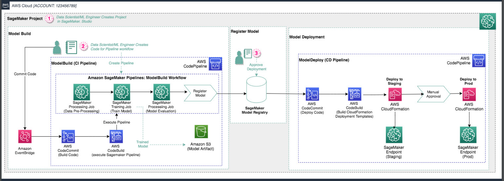

# AWS SageMaker MLOps Pipeline

## Architecture Overview



This repository contains Terraform code to deploy a comprehensive MLOps pipeline using AWS SageMaker and related services. The architecture demonstrates a complete machine learning workflow from model development to production deployment, incorporating CI/CD practices for machine learning.

## Medium Article

[Building a Robust MLOps Pipeline with AWS SageMaker and Terraform](https://medium.com/@gursimran.pro.id/building-a-robust-mlops-pipeline-with-aws-sagemaker-and-terraform-66c2aee651d8) 
## Key Components

1. **SageMaker Project**: Initiates the MLOps workflow within SageMaker Studio.
2. **Model Build Phase**:
   - CodePipeline for CI (Continuous Integration)
   - SageMaker Processing jobs for data preprocessing, model training, and evaluation
   - Model artifact storage in Amazon S3
3. **Model Registration**: Utilizes SageMaker Model Registry for version control and lineage tracking.
4. **Model Deployment**:
   - Separate CodePipeline for CD (Continuous Deployment)
   - Staged deployment to staging and production environments
   - Manual approval step before production deployment
5. **SageMaker Endpoints**: Created in both staging and production for model serving.

## MLOps Best Practices Demonstrated

- **Version Control**: Both ML code and infrastructure code are version-controlled.
- **Automated ML Pipelines**: Ensures reproducibility and consistency in model development.
- **CI/CD for ML**: Separate pipelines for model building and deployment.
- **Model Registry**: Centralized model versioning and metadata management.
- **Staged Deployments**: Quality assurance via staging environment and manual approval.
- **Infrastructure as Code**: Entire setup is defined and deployed using Terraform.
- **Scalability**: Leverages AWS managed services for automatic scaling.

## Prerequisites

- AWS Account
- Terraform installed
- AWS CLI configured with appropriate permissions

## Deployment Instructions

1. Clone this repository:
```
git clone https://github.com/your-username/aws-sagemaker-mlops.git
cd aws-sagemaker-mlops
```
2. Initialize Terraform:
``` 
terraform init 
```
3. Review and modify variables in `variables.tf` if needed.

4. Plan the Terraform deployment:
```
terraform plan
```
5. Apply the Terraform configuration:
```
terraform apply
```
6. Confirm the action and wait for the deployment to complete.

## Usage

Once deployed, the MLOps pipeline can be used as follows:

1. Data Scientists/ML Engineers develop models in SageMaker Studio.
2. Code is committed to the CodeCommit repository.
3. The Model Build pipeline automatically triggers, executing preprocessing, training, and evaluation.
4. Successful models are registered in the SageMaker Model Registry.
5. The Model Deploy pipeline deploys the model to the staging environment.
6. After manual approval, the model is deployed to the production environment.

## Customization

The Terraform code can be customized to fit specific requirements:

- Modify instance types for SageMaker endpoints in `main.tf`
- Adjust IAM roles and policies in `iam.tf`
- Customize CodeBuild and CodePipeline configurations in `cicd.tf`

## Clean Up

To avoid incurring unnecessary costs, destroy the resources when they're no longer needed:
```
terraform destroy
```
## Contributing

Contributions to improve the architecture or documentation are welcome. Please follow the standard fork, branch, and pull request workflow.

## License

[MIT License](LICENSE)

## Contact

For any questions or feedback, please open an issue in this repository.

---
